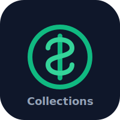

<p align="center">
  
</p>

<h1 align="center">Collection Portal</h1>

<p align="center">
  <strong>FE CREDIT debt collection portal — case management, strategy designer, and analytics.</strong>
</p>

<p align="center">
  
  
  
  
  
</p>

---

## Overview

**Collection Portal** is FE CREDIT's omnichannel debt collection platform. It provides
real-time visibility into collection operations, role-based access for collectors and
managers, ML-driven scoring, compliance monitoring, and strategy configuration.

Branded for **FE CREDIT** (VPB SMBC Finance Company) with the corporate red palette
adapted from [fecredit.com.vn](https://fecredit.com.vn).

## Features

- **Role-based access** — Admin, Manager, Collector, and Viewer roles with route guards
- **Usage guide** — Tabbed in-app documentation for each role
- **Case management** — Track and manage collection cases (B1–B5 buckets)
- **Strategy designer** — Build multi-channel collection strategies
- **Analytics dashboard** — Interactive charts and KPIs
- **Agent tracking** — Monitor productivity, call metrics, and outcomes
- **Scoring engine** — ML scoring models for account prioritization
- **Compliance module** — Regulatory compliance and audit trails
- **Vietnamese localization** — Full Vietnamese UI throughout
- **Light/dark themes** — Light by default (matches fecredit.com.vn)

## Tech Stack

| Layer | Technology |
|-------|-----------|
| Framework | Next.js 16 (App Router, Turbopack) |
| Language | TypeScript 5 (strict mode) |
| UI Components | shadcn/ui + Base UI + Radix |
| Styling | Tailwind CSS v4 |
| State | Zustand with persistence |
| Charts | Recharts |
| Data Import | PapaParse (CSV) |
| Validation | Zod |

## Getting Started

### Prerequisites

- Node.js 20+
- npm or pnpm

### Installation

```bash
npm install
```

### Development

```bash
npm run dev
```

Open [http://localhost:3000](http://localhost:3000) in your browser.

### Build

```bash
npm run build
npm start
```

## Demo Accounts

| Username | Password | Role |
|----------|----------|------|
| `admin` | `admin123` | Administrator (full access) |
| `manager` | `manager123` | Collection Manager |
| `collector` | `collector123` | Field Collector |
| `viewer` | `viewer123` | Compliance Viewer (read-only) |

## Project Structure

```
src/
├── app/              # Next.js App Router pages
│   ├── guide/        # Role-based usage guide
│   ├── cases/        # Case management
│   ├── strategies/   # Strategy designer
│   └── ...
├── components/
│   ├── ui/           # Reusable UI primitives
│   ├── layout/       # Sidebar, header, route guard
│   └── auth/         # Login form
└── lib/
    ├── auth-store.ts    # Authentication state
    ├── permissions.ts   # Role-based access control
    ├── theme-store.ts   # Theme preferences
    └── store.ts         # Collections data store
```

## Scripts

| Command | Description |
|---------|-------------|
| `npm run dev` | Start development server |
| `npm run build` | Production build |
| `npm start` | Start production server |
| `npm run lint` | Run ESLint |

## Deployment

Deployed to Vercel: [project-sunshineai.vercel.app](https://project-sunshineai.vercel.app)

Mirrors:
- GitHub: [github.com/taiphan/collections-dashboard](https://github.com/taiphan/collections-dashboard)
- GitLab: [gitlab.com/taiphan/collections-dashboard](https://gitlab.com/taiphan/collections-dashboard)

## License

MIT — see [LICENSE](LICENSE).
