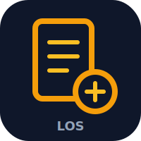

<p align="center">
  
</p>

<h1 align="center">LOS — Loan Origination System</h1>

<p align="center">
  <strong>End-to-end loan origination platform with automated decision engine, case processing, and SLA monitoring.</strong>
</p>

<p align="center">
  
  
  
  
  
  
</p>

---

## Overview

LOS is a full-stack loan origination system that automates the lending workflow from application intake through decisioning, underwriting, and funding. It features a rule-based decision engine, SLA monitoring with breach detection, and a modern React frontend.

## Features

### Backend
- **Case Processing Pipeline** — Multi-stage workflow (intake → review → decision → funding)
- **Decision Engine** — Automated rule evaluation with configurable criteria
- **SLA Monitoring** — Real-time deadline tracking with breach alerts
- **Background Workers** — BullMQ-powered async job processing
- **Redis Caching** — High-performance data caching layer
- **Rate Limiting** — Auth endpoint protection (5 attempts/15min)

### Frontend
- **Case Dashboard** — Filterable case list with status indicators
- **Application Workflow** — Step-by-step application processing
- **Real-Time Updates** — TanStack Query for server state synchronization
- **Role-Based UI** — Interface adapts to user permissions
- **Toast Notifications** — Non-blocking feedback for user actions

## Tech Stack

| Layer | Technology |
|-------|-----------|
| Frontend | React 18 + Vite |
| Backend | Express.js + Node.js 20 |
| Language | TypeScript 5 (strict) |
| Database | PostgreSQL 16 + Prisma ORM |
| Cache | Redis (ioredis) |
| Queue | BullMQ |
| Auth | JWT + bcrypt (12 rounds) |
| UI | Radix UI + Tailwind CSS 3 |
| State | Zustand + TanStack Query |
| Routing | TanStack Router |

## Getting Started

### Prerequisites

- Node.js 20+
- PostgreSQL 16+
- Redis 7+

### Installation

```bash
# Backend
cd los-system/backend
npm install
cp .env.example .env  # Configure database URL, Redis, JWT secret
npx prisma migrate dev
npx prisma db seed

# Frontend
cd ../frontend
npm install
```

### Development

```bash
# Terminal 1 — Backend (port 4000)
cd backend
npm run dev

# Terminal 2 — Frontend (port 3011)
cd frontend
npx vite --port 3011
```

### Build

```bash
# Backend
cd backend
npm run build

# Frontend
cd frontend
npm run build
```

## Project Structure

```
los-system/
├── backend/
│   ├── src/
│   │   ├── routes/         # API route handlers
│   │   ├── services/       # Business logic
│   │   ├── workers/        # Background job processors
│   │   └── server.ts       # Express app entry
│   └── prisma/
│       ├── schema.prisma   # Database schema
│       └── seed.ts         # Seed data
├── frontend/
│   ├── src/
│   │   ├── pages/          # Route pages
│   │   ├── components/     # UI components
│   │   ├── hooks/          # Custom hooks
│   │   └── stores/         # Zustand stores
│   └── index.html
└── README.md
```

## API Endpoints

| Method | Endpoint | Description |
|--------|----------|-------------|
| POST | `/api/auth/login` | Authenticate user |
| GET | `/api/cases` | List cases (paginated) |
| POST | `/api/cases` | Create new case |
| GET | `/api/cases/:id` | Get case details |
| PUT | `/api/cases/:id/stage` | Advance case stage |
| GET | `/api/applications` | List applications |
| POST | `/api/decisions/evaluate` | Run decision engine |

## License

This project is licensed under the MIT License — see the [LICENSE](LICENSE) file for details.
